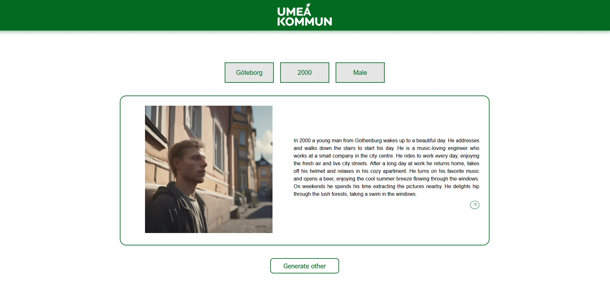
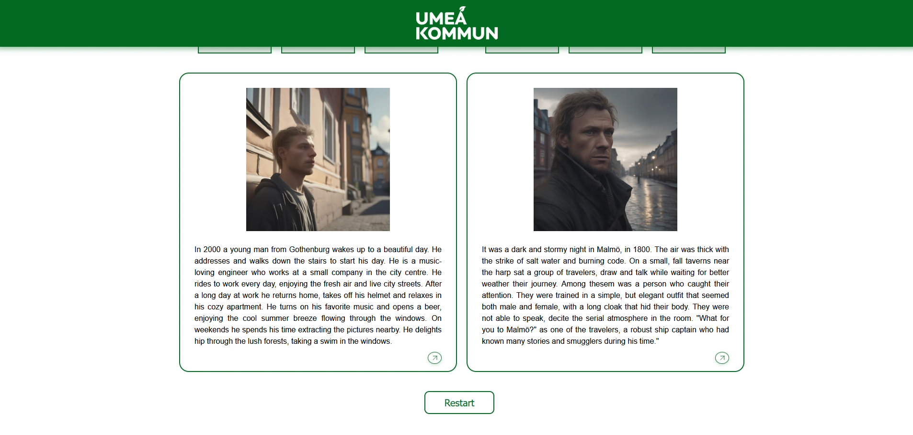

# 🎡 Spin the Wheel!

> An AI-powered interactive storytelling platform that explores **gender identities across different historical periods and regions of Sweden** through procedurally generated narratives and illustrations.

The project reimagines the original **"Spin the Wheel!"** concept by leveraging **Generative AI** to create historically grounded life scenarios. Users are assigned randomized identities and experience how gender, geography, and historical context influenced everyday life, encouraging reflection on equality, diversity, and social change.

Developed in collaboration with the **Gender Equality Office of Umeå Municipality** and **Umeå University**, the project focuses on generating transparent, trustworthy, and culturally accurate stories supported by traceable historical sources.

---

## 📸 Preview

| One story | Two stories |
|------|-----------------|
|  |  |

---

## ✨ Features

- 🎡 Interactive "Spin the Wheel" experience
- 🤖 AI-generated historical life stories
- 🖼️ AI-generated illustrations accompanying each story
- 🇸🇪 Scenarios covering different Swedish regions and historical periods
- 👥 Exploration of gender identities and societal norms
- 📚 Historically informed and traceable content generation
- ⚖️ Focus on fairness, bias mitigation, and ethical AI
- 🔍 Explainable AI concepts for increased transparency
- 🎮 Gamified educational experience

---

## 🏗️ Project Goals

The objective of the project is to build a proof-of-concept platform capable of automatically generating historically accurate stories and images while promoting awareness of gender equality throughout Swedish history.

The system aims to:

- Generate realistic historical scenarios using Generative AI
- Represent different genders, locations, and historical periods
- Ground generated content in trustworthy historical sources
- Reduce cultural and historical bias in AI-generated narratives
- Provide transparency regarding how stories are produced
- Encourage discussion and reflection through interactive storytelling

---

## 🛠️ Technologies

Depending on the implementation, the project makes use of technologies such as:

- TypeScript
- React
- Next.js
- Tailwind CSS
- Node.js
- OpenAI APIs
- Image Generation Models
- Retrieval-Augmented Generation (RAG)
- Large Language Models (LLMs)

---

## 📂 Project Structure

```
spin-the-wheel/
├── app/               # Application pages
├── components/        # Reusable UI components
├── public/            # Static assets
├── lib/               # Business logic and utilities
├── styles/            # Styling
└── README.md
```

---

## 🎯 Learning Outcomes

This project explores several modern software engineering and AI concepts, including:

- Generative AI applications
- Human-centered AI design
- Prompt engineering
- Explainable AI (XAI)
- Retrieval-Augmented Generation (RAG)
- Ethical AI
- Bias mitigation
- Interactive storytelling
- Full-stack web development

---

## 🤝 Stakeholders

This project was developed in collaboration with:

- **Umeå Municipality – Gender Equality Office**
- **Umeå University**

---

## 🌍 Purpose

The project demonstrates how Generative AI can be used responsibly to create educational experiences that foster empathy, historical understanding, and awareness of gender inequality across different places and periods in Swedish history.

Rather than presenting history through static information, the platform allows users to experience diverse perspectives through personalized, AI-generated narratives.

---

## 📄 License

This project was developed for academic and research purposes.